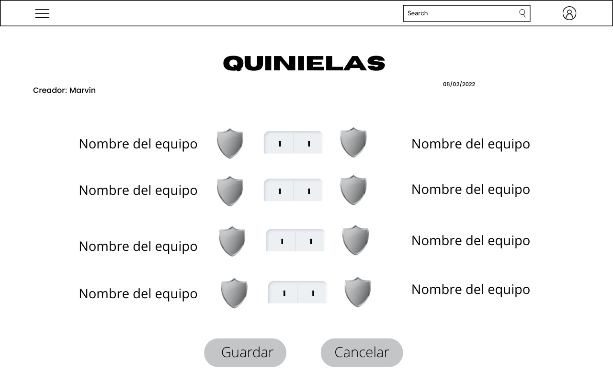
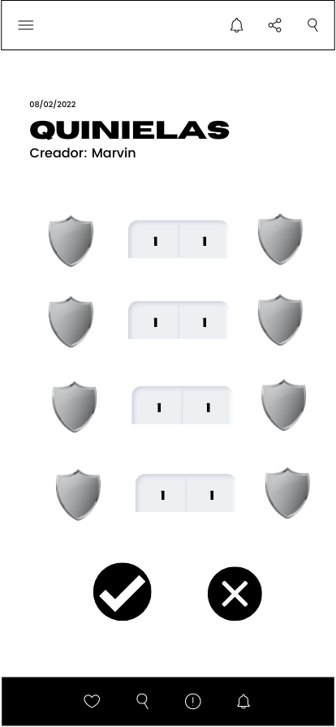

# Soccer Stats

## Resumen de la aplicación

"Soccer Stats" es un sistema web, pensado para aficionados al fútbol que deseen verificar datos estadísticos de partidos anteriores, con el propósito de realizar un análisis de los resultados de los futuros partidos.

También contará con una aplicación móvil, en la que podrá realizar todas las funcionalidades que están en la página web sin ningún tipo de impedimento. Tendrá notificaciones al instante, con las noticias más acutalizadas de los partidos, jugadores, resultados y sorteos.

Para el uso de dicho sistema, se tendrán dos opciones, una cuenta gratis y una membresía mensual. La cual tendrá un precio de Q15.00, todos los usuarios podrán adquirirla o ponerle fin en cualquier momento.

Con la membresía los usuarios podrán ver datos de sus equipos preferidos, como los partidos entrantes, información de los jugadores, técnicos a cargo, torneos ganados, etc.
También tendrán acceso a un algoritmo de predicción de resultados el cuál está en constante aprendimiento para poder brindar un resultado lo más acertado posible.

## Lenguaje de Programación 💻

### SQL 
 
 SQL es un lenguaje de dominio específico, diseñado para administrar, y recuperar información de sistemas de gestión de bases de datos relacionales.​

 Dado que no es solo una base que se encarga de almacenar partidos y resultados, lo ideal es utilizar este lenguaje.

 
###  JavaScript

JavaScript es un lenguaje de programación interpretado, dialecto del estándar ECMAScript. Se define como orientado a objetos, ​ basado en prototipos, imperativo, débilmente tipado y dinámico.

Dado que que en esta ocacion es una pagina web y una app, un lenguaje ideal es javascritp. 

 

-----
 

## Herramientas de Metodología
### Scrum
Se utilizará la metodología scrum. Se llevará a cabo por medio de *sprints*, con duración de una(1) semana para lograr el desarrollo de una función específica, tiempo que se considera adecuado para realizar la entrega de esa funcionalidad. De esta forma, se asegura la entrega continua de un producto que se ira completando con el tiempo, y a la vez, con la certeza que se están controlando los cambios.

En general se trata de definir las tareas a realizar en todo el proyecto, luego elegir las que se realizaran en cada sprint, y ponerlo en marcha. Las tareas se organizan y listan en los llamados product y sprint backlog, los cuales tendrán todas las tareas y las que se realizarán en cada sprint, respectivamente.

 
 

 
 

### Product y Sprint Backlog - Trello
A través de un tablero Kanban proporcionado por la herramienta Trello se listarán las tareas de los backlogs. Trello permite organizar dichas tareas en diferentes listas, además de añadirle categorías a cada tarea, asignarlas a cada miembro del equipo. De esta forma, el control de las diferentes etapas del proyecto y cada sprint.

 
 

 
 

 

-----
 

## Tecnologías y Frameworks a Utilizar.

### Integración Continua
#### Microservicios - Docker
Se generarán microservicios y se empaquetarán con Docker, que permite colocar toda la lógica de una funcionalidad dentro de un contenedor, que servirá más adelante para ponerlos en marcha de forma dinámica o en caso de que fallen, crearlos nuevamente de forma sencilla.

 

 

 

#### Orquestación de Contenedores - Docker Compose
Sera utilizado para administrar los contenedores, a la vez que con un simple archivo tendremos configurados todos los microservicios.

 

 

#### Automatización - Jenkins
Sera utilizado para automatizar las tareas necesarias para realizar la integración y despliegue continuo. Nuestra guía será el repositorio de GitHub, y a partir de ahí, en caso de que se realicen cambios en la rama *master*, se realizaran las acciones necesarias para lograr el despliegue automático.

 

 

#### MySQl - RDBMS

MySQL es un código abierto sistema de gestión de base de datos relacional (RDBMS).  Es un software gratuito y de código abierto bajo los términos de la Licencia Pública General GNU y también está disponible bajo una variedad de licencias propietarias 

#### Angular

Angular es un framework para aplicaciones web desarrollado en TypeScript, de código abierto, mantenido por Google, que se utiliza para crear y mantener aplicaciones web de una sola página. En esta ocacion podremos llegar a una plataforma intuitiva y amigable.

#### Node Js 
 
 El proyecto será desarrollado en node Js, que es un entorno en tiempo real de ejecución multiplataforma, basado en Javascript y orientado a eventos asíncronos. Esta diseñado para crear aplicaciones escalables, permitiendo establecer y gestionar multiples conexiones al mismo tiempo.

 Node.js será utilizado para desarrollar todos los microservicios del lado del backend.

 
 

  

 

#### JWT
Se necesita la verificación de permisos de acuerdo al rol de cada usuario, para dicha tarea se implementara JWT para poder gestionar las credenciales como tokens y proporcionar el acceso a los módulos correspondientes.

## Maquetación 

### Quinielas

En el sitio web tendremos una sección de quinielas se mostrará el usuario que creo la quiniela y la fecha, además abajo aparecerán los nombres y escudos de los equipos de futbol, se tendrá un label donde el usuario podrá ingresar el puntaje de los partidos y participar por un premio de una membresía de 2 meses.

En la aplicación móvil también se podrá visualizar las quinielas, la única diferencia del diseño web es que en esta sección ya no apareceran los nombres del equipo, solamente el escudo del equipo. 

### Diagrama de Arquitectura

## Ciclo DevOps

