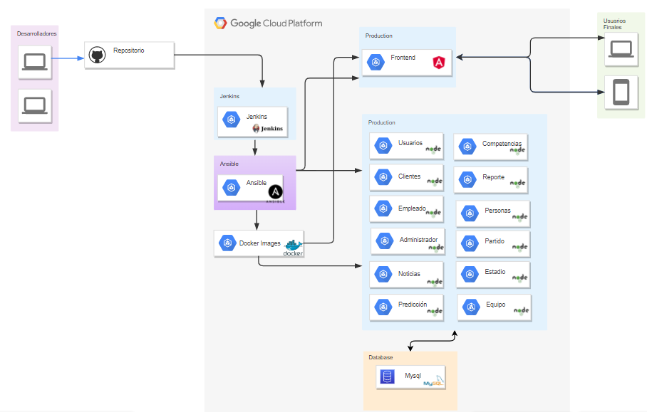
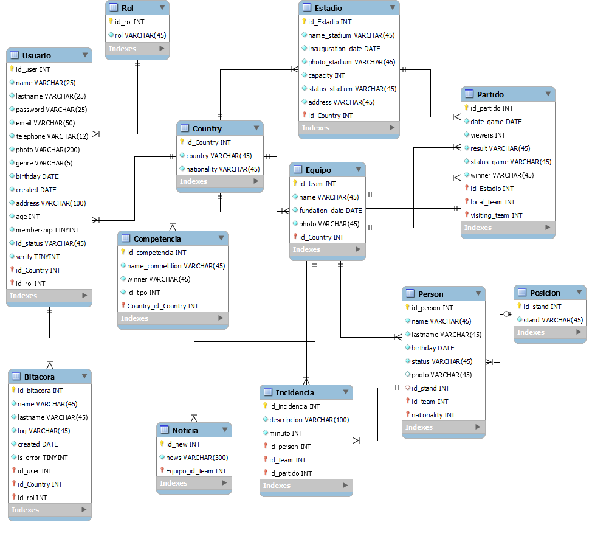

# Soccer Stats

## Información sobre la empresa

### Logo

### Misión

Proveer a los usuarios con lo último en noticias sobre fútbol, siendo una herramienta que les permita buscar y evaluar el desempeño pasado, presente y futuro de sus equipos favoritos a través de análisis estadísticos a solo unos clics.

### Visión

Ser un referente mundial en el medio de noticias y datos historicos para los amantes del fútbol, poniendo al alcance de todos la información y herramientas para su análisis a través de la innovación tecnológica.

## Resumen de la aplicación

"Soccer Stats" es un sistema web, pensado para aficionados al fútbol que deseen verificar datos estadísticos de partidos anteriores, con el propósito de realizar un análisis de los resultados de los futuros partidos.

También contará con una aplicación móvil, en la que podrá realizar todas las funcionalidades que están en la página web sin ningún tipo de impedimento. Tendrá notificaciones al instante, con las noticias más acutalizadas de los partidos, jugadores, resultados y sorteos.

Para el uso de dicho sistema, se tendrán dos opciones, una cuenta gratis y una membresía mensual. La cual tendrá un precio de Q15.00, todos los usuarios podrán adquirirla o ponerle fin en cualquier momento.

Con la membresía los usuarios podrán ver datos de sus equipos preferidos, como los partidos entrantes, información de los jugadores, técnicos a cargo, torneos ganados, etc.
También tendrán acceso a un algoritmo de predicción de resultados el cuál está en constante aprendimiento para poder brindar un resultado lo más acertado posible.

## Lenguaje de Programación 💻

### SQL

 SQL es un lenguaje de dominio específico, diseñado para administrar, y recuperar información de sistemas de gestión de bases de datos relacionales.​

 Dado que no es solo una base que se encarga de almacenar partidos y resultados, lo ideal es utilizar este lenguaje.

 
### JavaScript

JavaScript es un lenguaje de programación interpretado, dialecto del estándar ECMAScript. Se define como orientado a objetos, ​ basado en prototipos, imperativo, débilmente tipado y dinámico.

Dado que que en esta ocacion es una pagina web y una app, un lenguaje ideal es javascritp. 

 

-----
 

## Herramientas de Metodología

### Scrum

Se utilizará la metodología scrum. Se llevará a cabo por medio de *sprints*, con duración de una(1) semana para lograr el desarrollo de una función específica, tiempo que se considera adecuado para realizar la entrega de esa funcionalidad. De esta forma, se asegura la entrega continua de un producto que se ira completando con el tiempo, y a la vez, con la certeza que se están controlando los cambios.

En general se trata de definir las tareas a realizar en todo el proyecto, luego elegir las que se realizaran en cada sprint, y ponerlo en marcha. Las tareas se organizan y listan en los llamados product y sprint backlog, los cuales tendrán todas las tareas y las que se realizarán en cada sprint, respectivamente.

 
 

 
 

### Product y Sprint Backlog - Trello

A través de un tablero Kanban proporcionado por la herramienta Trello se listarán las tareas de los backlogs. Trello permite organizar dichas tareas en diferentes listas, además de añadirle categorías a cada tarea, asignarlas a cada miembro del equipo. De esta forma, el control de las diferentes etapas del proyecto y cada sprint.

 
 

 
 

 

-----
 

## Tecnologías y Frameworks a Utilizar.

### Integración Continua

#### Microservicios - Docker

Se generarán microservicios y se empaquetarán con Docker, que permite colocar toda la lógica de una funcionalidad dentro de un contenedor, que servirá más adelante para ponerlos en marcha de forma dinámica o en caso de que fallen, crearlos nuevamente de forma sencilla.

 

 

 

#### Orquestación de Contenedores - Docker Compose

Sera utilizado para administrar los contenedores, a la vez que con un simple archivo tendremos configurados todos los microservicios.

 

 

#### Automatización - Jenkins

Sera utilizado para automatizar las tareas necesarias para realizar la integración y despliegue continuo. Nuestra guía será el repositorio de GitHub, y a partir de ahí, en caso de que se realicen cambios en la rama *master*, se realizaran las acciones necesarias para lograr el despliegue automático.

 

 

#### MySQl - RDBMS

MySQL es un código abierto sistema de gestión de base de datos relacional (RDBMS).  Es un software gratuito y de código abierto bajo los términos de la Licencia Pública General GNU y también está disponible bajo una variedad de licencias propietarias 

#### Angular

Angular es un framework para aplicaciones web desarrollado en TypeScript, de código abierto, mantenido por Google, que se utiliza para crear y mantener aplicaciones web de una sola página. En esta ocacion podremos llegar a una plataforma intuitiva y amigable.

#### Node Js 
 
 El proyecto será desarrollado en node Js, que es un entorno en tiempo real de ejecución multiplataforma, basado en Javascript y orientado a eventos asíncronos. Esta diseñado para crear aplicaciones escalables, permitiendo establecer y gestionar multiples conexiones al mismo tiempo.

 Node.js será utilizado para desarrollar todos los microservicios del lado del backend.

 
 

  

 

#### JWT

Se necesita la verificación de permisos de acuerdo al rol de cada usuario, para dicha tarea se implementara JWT para poder gestionar las credenciales como tokens y proporcionar el acceso a los módulos correspondientes.

## Maquetación 
## Documentación de la aplicación

### Quinielas

En el sitio web tendremos una sección de quinielas se mostrará el usuario que creo la quiniela y la fecha, además abajo aparecerán los nombres y escudos de los equipos de futbol, se tendrá un label donde el usuario podrá ingresar el puntaje de los partidos y participar por un premio de una membresía de 2 meses.

En la aplicación móvil también se podrá visualizar las quinielas, la única diferencia del diseño web es que en esta sección ya no apareceran los nombres del equipo, solamente el escudo del equipo. 

## Diagrama de Arquitectura

El backend del proyecto se desarrollará en nodejs, los servicios se encuentran dividido en microservicios los cuales son: usuarios, clientes, empleado, administrador, noticias y predicción. Cada uno de ellos posee autenticación jwt y se conecta al frontend para poder consumir los diferentes endpoints. 

Cada uno de los microservicios, así como la app de angular estará desplegado en un contenedor. Utilizaremos Jenkins para automatizar el proyecto y permitir el flujo de la integración continua y la entrega continua, posteriormente de integrar los cambios y pasar las pruebas se procederá a realizar el lanzamiento de nuestro proyecto con Ansible. Esto se realizará con maquinas virtuales de google cloud. 

### Ciclo DevOps

<<<<<<< HEAD

## ER

### Historias de Usuario

#### Cliente

|     3 | Historia de usuario                                                                                                                                             | Descripción                                                                                                                                                                                                                                                                                                                                         | Criterios de aceptación                                                                                                                                                                         | Dependencias |
|------:|-----------------------------------------------------------------------------------------------------------------------------------------------------------------|-----------------------------------------------------------------------------------------------------------------------------------------------------------------------------------------------------------------------------------------------------------------------------------------------------------------------------------------------------|-------------------------------------------------------------------------------------------------------------------------------------------------------------------------------------------------|--------------|
| HUC1  | Como cliente, quiero registrarme en el sistema, para tener un perfil personal.                                                                                  | Se crea un nuevo usuario con información del cliente y sus preferencias, y se almacena en la base de datos, a través de un formulario disponible en el sistema. La nueva cuenta debe ser validada por el usuario a través de un link enviado a su correo electrónico. La cuenta toma el estatus de "Activa" cuando ha sido validada por el usuario. | - El cliente activa la cuenta a través de el link recibido en su correo electrónico. - El cliente puede iniciar sesión con sus credenciales registradas.                                        |              |
| HUC2  | Como cliente, quiero iniciar sesión en el sistema, para poder tener acceso a la información de la aplicación.                                                   | El cliente ingresa su correo electrónico y su contraseña, esto para validar e iniciar sesión en el sistema.                                                                                                                                                                                                                                         | El usuario es válido y se encuentra activo. Se muestra el nombre del usuario en un área de la página. Se redirige al usuario a la página de bienvenida.                                         | HUC1         |
| HUC3  | Como cliente, quiero cerrar la sesión en el sistema, para mantener mi privacidad.                                                                               | El cliente solicita el cierre de sesión a través de un botón en alguna parte de la página. La sesión es cerrada por lo que ya no pueda acceder a ningún módulo.                                                                                                                                                                                     | Se elimina la sesión activa del usuario. Ya no es accesible ningún módulo del sistema por falta de permiso.                                                                                     | HUC2         |
| HUC4  | Como cliente, quiero visualizar la información ingresada en mi cuenta, para validar que dicha información es correcta.                                          | Se presentan los datos del usuario en la página de "Perfil".                                                                                                                                                                                                                                                                                        | Los datos pueden ser visualizados por el usuario.                                                                                                                                               | HUC2         |
| HUC5  | Como cliente, quiero editar la información de mi cuenta, para mantener dicha información actualizada.                                                           | Se presenta al usuario un botón "Editar" en la página "Perfil", el cual lleva al usuario a un formulario con los datos actuales, los cuales pueden ser modificados y guardados nuevamente.                                                                                                                                                          | El usuario puede modificar cualquier dato personal que no sea el correo electronicó.                                                                                                            | HUC2         |
| HUC6  | Como cliente, quiero eliminar mi cuenta, para que ya no sea posible acceder a la misma de manera permanente.                                                    | Se presenta un botón "Eliminar Cuenta" en la página de "Perfil", la cual presenta un mensaje de confirmación para eliminar la cuenta, cuando el usuario confirma la acción, la cuenta es marcada como inactiva y no se puede iniciar sesión.                                                                                                        | La cuenta es inactivada, y el usuario ya no puede iniciar sesión con su usuario y contraseña.                                                                                                   | HUC2         |
| HUC7  | Como cliente, quiero restablecer mi contraseña a través de correo electronicó, para tener un medio de recuperación en caso de perdida.                          | El usuario solicita la recuperación de contraseña al correo, recibiendo un correo con el link al login y una contraseña provisional la cual debe ser cambiada por el usuario.                                                                                                                                                                       | El usuario registra una nueva contraseña para su cuenta y puede iniciar sesión nuevamente.                                                                                                      | HUC1         |
| HUC8  | Como cliente, quiero poder pagar una membresía, para tener acceso a contenido exclusivo.                                                                        | El cliente, paga una membresía mensual, la cual le da acceso a características premium.                                                                                                                                                                                                                                                             | El usuario pagó el mes de membresía. El usuario tiene acceso a las características premium.                                                                                                     | HUC2         |
| HUC9  | Como cliente, quiero "Seguir" a mis equipos favoritos, para tener acceso rápido a sus estadísticas y noticias.                                                  | El cliente puede agregar un equipo a sus favoritos, por lo que podrá acceder de manera más fácil a la información de dicho equipo en la página principal.                                                                                                                                                                                           | El usuario puede seguir a un equipo. El equipo aparece en el listado de equipos seguidos. En la página principal, aparecen las últimas noticias referentes a dicho equipo.                      | HUC8         |
| HUC10 | Como cliente, quiero realizar consultas de datos estadísticos, para poder realizar análisis propios del desempeño de un equipo, jugador, técnico, etc.          | Se le presenta al cliente una lista de consultas que puede realizar, donde el cliente completa los datos solicitados para realizar dicha consulta, luego se le muestra los resultados.                                                                                                                                                              | El usuario tiene acceso al módulo de consultas. Puede realizar consultas.                                                                                                                       | HUC8         |
| HUC11 | Como cliente, quiero filtrar las noticias respecto a mis equipos favoritos, o ver el listado general, para poder tener mayor control de la información que leo. | El usuario puede elegir si filtrar las noticias en las que aparezcan sus equipos favoritos, o listar todas las noticias.                                                                                                                                                                                                                            | Se presenta un menú con la opción de filtrar por equipos seguidos o general. Se muestra el listado que cumpla con el filtro.                                                                    | HUC8         |
| HUC12 | Como cliente, quiero tener acceso a un módulo de predicción de resultados de partidos, para tener una ayuda en la toma de decisiones en las quinielas.          | El usuario puede elegir realizar una predicción para un partido, donde se analizaron datos históricos y se presenta una predicción del resultado.                                                                                                                                                                                                   | Se ofrece una predicción del resultado del partido al usuario.                                                                                                                                  | HUC8         |
| HUC13 | Como cliente, quiero participar en quinielas, para poder obtener premios.                                                                                       | El usuario puede ingresar los resultados para un partido antes de que éste inicie. Si el usuario acierta, recibe un incentivo.                                                                                                                                                                                                                      | El usuario ingresa su predicción de resultado y se almacena en el sistema. Solo se puede ingresar o modificar antes de que el partido inicie. Se valida los resultados al finalizar el partido. | HUC8         |

#### Empleado

| Cod. | Historia de usuario                                                                                                      | Descripción                                                                                                                                                             | Criterios de aceptación                                                                                                        | Dependencia |
|------|--------------------------------------------------------------------------------------------------------------------------|-------------------------------------------------------------------------------------------------------------------------------------------------------------------------|--------------------------------------------------------------------------------------------------------------------------------|-------------|
| HUE1 | Como empleado, quiero ingresar información al sistema, para mantener actualizada la base de datos estadística.           | El empleado cuenta con formularios de ingreso para nuevos elementos de información, como estadios, equipos, partidos, resultados, etc.                                  | La información es almacenada en la base de datos y se encuentra disponible para ser consultada por los usuarios.               |             |
| HUE2 | Como empleado, quiero modificar información ingresada anteriormente, para poder mantener los datos actualizados.         | El empleado tiene acceso a modificar los datos ingresados anteriormente, y puede guardar los nuevos cambios.                                                            | Los cambios en la información se ve reflejada de manera inmediata despues de guardarlos.                                       |             |
| HUE3 | Como empleado, quiero transferir jugadores de un equipo a otro, para mantener la plantilla de jugadores actualizada.     | El empleado cambia la afiliación de un jugador a otro equipo. Dicho cambio se debe registrar en la bitácora de equipos del jugador.                                     | El jugador aparece en la plantilla del nuevo equipo. En el perfil del jugador aparece que pertenece al nuevo equipo.           |             |
| HUE4 | Como empleado, quiero transferir un técnico a otro equipo, para mantener la plantilla técnica actualizada.               | El empleado cambia el equipo al cual pertenece un técnico. El cambio se registra en la bitácora del técnico.                                                            | El cambio se ve reflejado en el perfil del equipo. Se validan correctamente la relación de 1 a 1 entre un técnico y un equipo. |             |
| HUE5 | Como empleado, quiero modificar el estado de un partido, para que concuerde con el estado real.                          | El empleado puede cambiar el estado de un partido a Sin iniciar, En proceso, Finalizado, Suspendido.                                                                    | El cambio de estado se ve reflejado de manera inmediata.                                                                       |             |
| HUE6 | Como empleado,quiero agregar incidencias durante la realización de un partido, para mantener la información actualizada. | El empleado agrega registros de eventos que suceden durante el partido, como lo es faltas, penalizaciones, etc. Esto solo es posible mientras el partido está en curso. | La incidencia crea un registro en la base de datos, y está se refleja en los datos del partido de manera inmediata.            |             |
| HUE7 | Como empleado, quiero agregar noticias sobre un equipo, para que estas estén disponibles a los usuarios.                 | El empleado agrega un artículo el cual está relacionado con un equipo, y éste será accesible por los usuarios en la página de noticias.                                 | La noticia es almacenada en la base de datos y es accesible por los usuarios.                                                  |             |
| HUE8 | Como empleado, quiero crear quinielas, para que los clientes puedan participar en ellas.                                 | El empleado crea una nueva quiniela y la pone a disposición de los usuarios.                                                                                            | La quiniela se almacena en el sistema. Los usuarios pueden participar en la quiniela.                                          |             |

#### Administrador

| Cod. | Historia de usuario                                                                                                                                                           | Descripción                                                                                                                                                                  | Criterios de aceptación                                                                                                                                                               | Dependencia |
|------|-------------------------------------------------------------------------------------------------------------------------------------------------------------------------------|------------------------------------------------------------------------------------------------------------------------------------------------------------------------------|---------------------------------------------------------------------------------------------------------------------------------------------------------------------------------------|-------------|
| HUA1 | Como administrador, quiero crear nuevas cuentas, para poder dar acceso al sistema.                                                                                            | Un usuario administrador puede crear nuevas cuentas, sin importar si el rol es Cliente, Empleado u Administrador.                                                            | El administrador puede crear nuevos usuarios válidos en el sistema.                                                                                                                   |             |
| HUA2 | Como administrador, quiero modificar el estatus de una cuenta, para poder tener un control sobre las mismas.                                                                  | Un administrador puede dar de alta, baja, congelar, visualizar o actualizar una cuenta de cualquier usuario, para lo cual debe registrar la razón de dicha acción en un log. | El estado de la cuenta cambia al estado definido por el administrador.                                                                                                                |             |
| HUA3 | Como administrador, quiero tener acceso al log de operaciones realizadas sobre usuarios, para tener control de las acciones realizadas sobre los usuarios en el sistema.      | Un administrador, puede visualizar el log de acciones sobre otras cuentas realizadas, donde se muestra la descripción de porqué se realizó dicha operación.                  | El administrador visualiza los datos del log de acciones sobre cuentas.                                                                                                               |             |
| HUA4 | Como administrador, quiero que exista una página de "Access Denied", para informar a los usuarios que no tienen acceso a un área del sistema.                                 | Se muestra una página con un mensaje de acceso denegado, cuando el usuario intenta ingresar a un modula al cual no tiene permisos.                                           | El usuario visualiza una página de "Access Denied" cuando intenta visualizar un módulo al cual no tiene acceso.                                                                       |             |
| HUA5 | Como administrador, quiero realizar reportes sobre los usuarios usando distintos criterios e imprimirlos en pdf si es necesario, para tener idea del desempeño de los mismos. | El administrador cuenta con un módulo de reportes donde puede realizar consulta sobre aspectos claves para usuarios "Empleado" y "Cliente".                                  | El administrador puede visualizar e imprimir en pdf reportes realizados sobre los usuarios y sus características, cumpliendo los reportes del listado de "Reportes de administrador". |             |

## Anexos

### Listado reportes de "Administrador"

- Usuarios Suscritos a X equipo
- Usuario Con o Sin Membresía
- Usuarios que Mas membresías han adquirido
- Usuarios que más dinero han gastado
- Usuarios de X País
- Usuarios de X genero
- Usuarios con al menos X años de edad
- Empleados que MAS/MENOS noticias han publicado
- Empleados que MAS/MENOS noticias han publicado de X Equipo
- Bitácoras de los administradores

### Listado de consultas estadisticas para usuarios

- Jugadores o Técnico de X equipo
- Jugadores o Técnico mayores a X años
- Jugadores o Técnico menores a X años
- Equipos que participaron en X competición
- Equipos de X país
- Equipos con X años de antigüedad
- Estadios en X país
- Estadios con capacidad menor o igual a X
- Histórico de partidos de X equipo
- Equipos en los que ha estado o dirigido X técnico o jugador.
- Partidos donde hubo al menos X goles
- Jugadores con más X incidencias en Y competición
- Jugadores con más X incidencias y Y competiciones de Z año
- Cantidad de X competiciones que ha ganado Y equipo
- Listado de partidos en X año
- Listado de partidos entre X equipo contra Y equipo
- Listado de partidos de X equipo
=======

>>>>>>> reqdoc_DiagramaArquitectura
